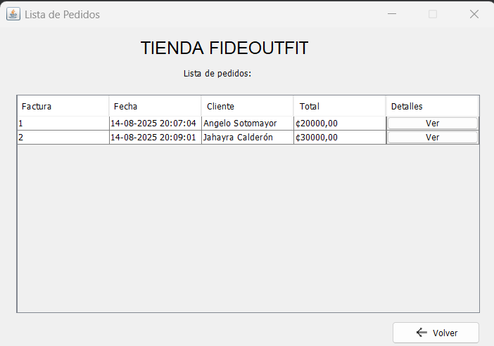
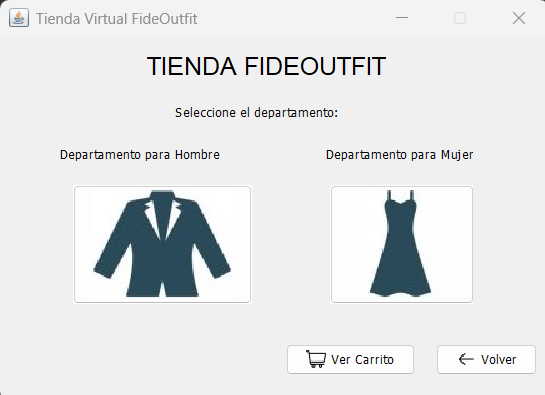
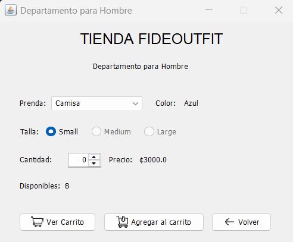
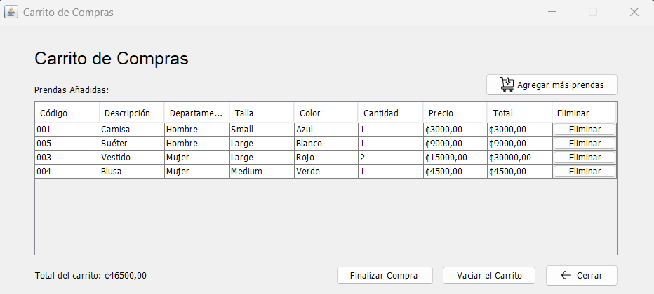
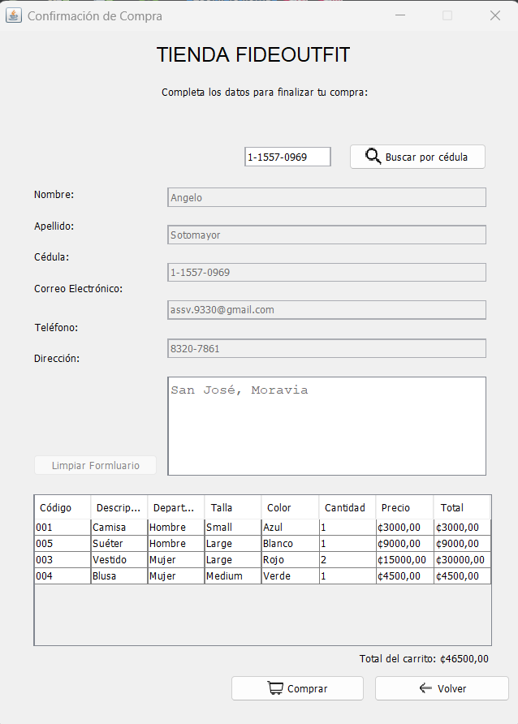
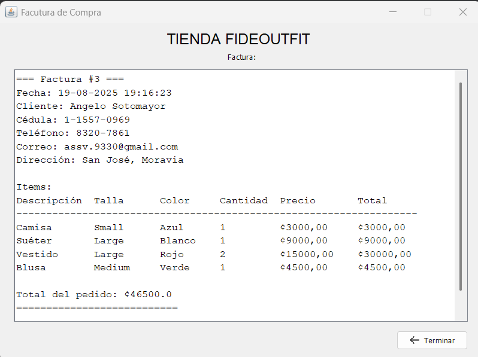

# Tienda FideOutfit

Small **Java (Swing)** desktop application that simulates a simple clothing store with customer management, inventory, shopping cart, and order processing.  
This project is part of my portfolio and was developed with the goal of **practicing object-oriented programming (OOP) fundamentals**, file-based persistence, and the creation of user-friendly graphical interfaces.

---

## About the project

**Tienda FideOutfit** is a basic management system for a clothing store. Although it is not connected to a database, it uses `.txt` files to simulate data persistence, which is very useful for practice before moving to more complex systems.  

During the development, I applied key concepts such as:  
- **Encapsulation and modularity**: each entity (Customer, Clothing Item, Cart Item, Order) was modeled in its own class.  
- **Separation of logic and presentation**: business logic is placed in `Gestion` classes, while graphical interfaces are in the `vistas` package.  
- **Simple persistence**: data is stored in `.txt` files to register customers, inventory, and orders.  
- **Good programming practices**: clear methods, input validation, and basic error handling.  

This project helped me strengthen my understanding of business logic for sales systems and how to organize a program into simple layers.

---

## Main features

- **Customer management**: register, edit, and list customers from the GUI.  
- **Inventory management**: add, edit, and remove clothing items; automatic listing when opening the window.  
- **Shopping cart**: select items, set quantities, and calculate per-item and total amounts.  
- **Order management**: finalize purchase, associate with a customer, and save to file.  
- **File persistence**: all data is saved into the `/Datos` folder in `.txt` format.  

---

## Project structure

```plaintext
src/
 └── tiendafideoutfit/
      ├── modelos/        # Entity classes (Customer, Clothing Item, Cart Item, Order, etc.)
      ├── gestion/        # Business logic (GestionCliente, GestionPrenda, GestionCarrito, GestionPedido)
      └── vistas/         # Graphical interfaces (Swing)
Datos/                     # .txt files used to store customers, inventory, and orders
```

---

## Capturas de pantalla

### Main Window
<p align="center">
  
</p>

### Admin Profile
<p align="center">
  
</p>

### Customer Management
<p align="center">
  
</p>

### Inventory Management
<p align="center">
  
</p>

### Orders Management
<p align="center">
  
</p>

### Store View
<p align="center">
  
</p>

### Item Selection
<p align="center">
  
</p>

### Shopping Cart
<p align="center">
  
</p>

### Purchase Confirmation
<p align="center">
  
</p>

### Invoice
<p align="center">
  
</p>

---

## Download the application

You can download a compiled version of **TiendaFideoutfit** from the [Releases](../../releases) section.

[**Download TiendaFideoutfit v1.0.0**](https://github.com/Angelo-SV/TiendaFideOutfit/releases/download/v1.0/TiendaFideOutfit.zip)

### Execution instructions

1. Download the `.zip` file from the link above.
2. Extract the content into any folder on your PC.
3. Inside the folder, you will find an executable file (`TiendaFideoutfit.exe`).
4. Java installation is not required, since the application includes an embedded JVM. Note: do not delete the Datos folder!
5. Double click the executable to start the application.
6. To access the administrator module, use the following credentials:
- **Username:** `admin`  
- **Password:** `admin`  

---

## Multilanguage

This README is available in:  
- [English](README.md)  
- [Español](README.es.md)
