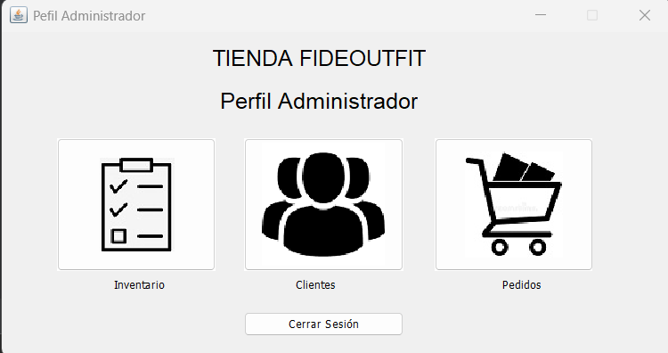
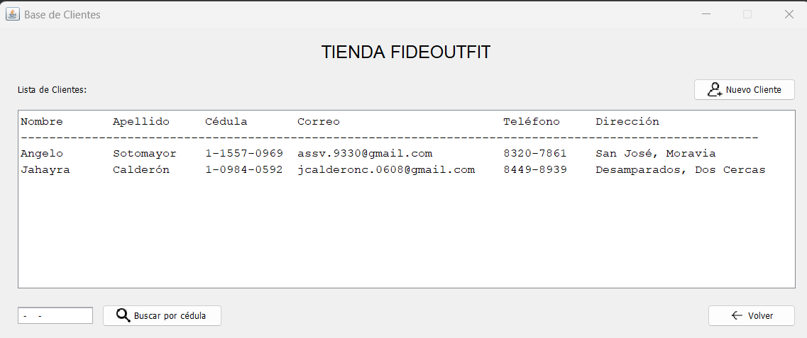
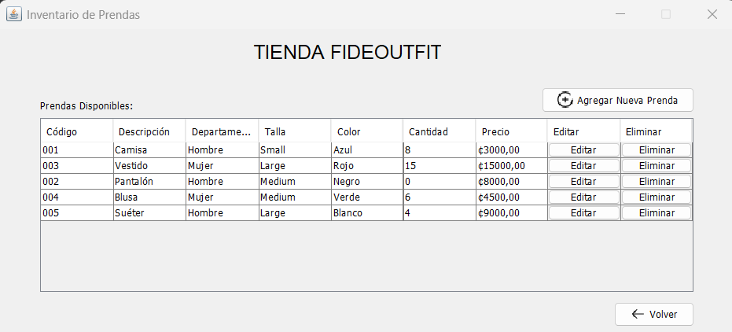

# Tienda FideOutfit

Pequeña aplicación de escritorio en **Java (Swing)** que simula una tienda de ropa muy sencilla con gestión de clientes, inventario, carrito de compras y pedidos.  
Este proyecto forma parte de mi portafolio y lo desarrollé con el objetivo de **poner en práctica los fundamentos de la programación orientada a objetos (POO)**, el manejo de persistencia en archivos y la construcción de interfaces gráficas amigables.

---

## Sobre el proyecto

La **Tienda FideOutfit** es un sistema básico de gestión para una tienda de ropa. Aunque no está conectado a una base de datos, aprovecha el almacenamiento en archivos `.txt` para simular la persistencia de datos, lo cual resulta útil como práctica inicial antes de migrar a sistemas más complejos.  

Durante el desarrollo apliqué conceptos clave como:  
- **Encapsulamiento y modularidad**: cada entidad (Cliente, Prenda, ItemCarrito, Pedido) se modeló en su propia clase.  
- **Separación de lógica y presentación**: la lógica de negocio está en clases `Gestion`, mientras que las interfaces gráficas están en el paquete `vistas`.  
- **Persistencia simple**: lectura y escritura de datos en archivos `.txt` para registrar clientes, inventario y pedidos.  
- **Buenas prácticas de programación**: uso de métodos claros, validaciones de entrada, y manejo básico de errores.  

Este proyecto me permitió afianzar la lógica de negocio de un sistema de ventas y comprender cómo organizar un programa en capas simples.

---

## ⚙️ Funcionalidades principales

- **Gestión de clientes**: registrar, editar y listar clientes desde interfaz.
- **Gestión de inventario**: añadir, editar y eliminar prendas; listado automático al abrir la ventana.
- **Carrito de compras**: selección de prendas, cantidades, cálculo de totales por ítem y acumulado.
- **Gestión de pedidos**: registro de compra final con cliente asociado y almacenamiento en archivo.
- **Persistencia en archivos**: todos los datos se guardan en la carpeta /Datos en formato .txt.

---

## 📂 Estructura del proyecto

```plaintext
src/
 └── tiendafideoutfit/
      ├── modelos/        # Clases de entidad (Cliente, Prenda, ItemCarrito, Pedido, etc.)
      ├── gestion/        # Lógica de negocio (GestionCliente, GestionPrenda, GestionCarrito, GestionPedido)
      └── vistas/         # Interfaces gráficas (Swing)
Datos/                     # Archivos .txt donde se almacenan clientes, inventario y pedidos
```

---

## 📸 Capturas de pantalla

### Pantalla principal
<p align="center">
  
</p>

### Perfil Administrador
<p align="center">
  
</p>

### Gestión Clientes
<p align="center">
  
</p>

### 📦 Gestión Inventario
<p align="center">
  
</p>

---

## 📦 Descargar la aplicación

Se puede  descargar una versión compilada de **TiendaFideoutfit** desde la sección de [Releases](../../releases).

➡️ [**Descargar TiendaFideoutfit v1.0.0**](https://github.com/Angelo-SV/TiendaFideOutfit/releases/download/v1.0/TiendaFideOutfit.zip)

### 🔧 Instrucciones de ejecución

1. Descarga el archivo `.zip` desde el enlace anterior.
2. Extrae el contenido en cualquier carpeta de tu PC.
3. Dentro de la carpeta encontrarás un archivo ejecutable (`TiendaFideoutfit.exe`).
4. **No es necesario instalar Java**, ya que la aplicación incluye la JVM embebida.
5. Haz doble clic en el ejecutable para iniciar la aplicación.

